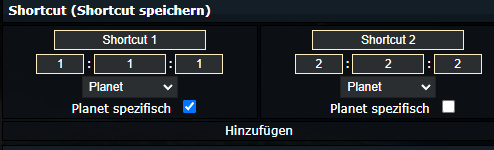
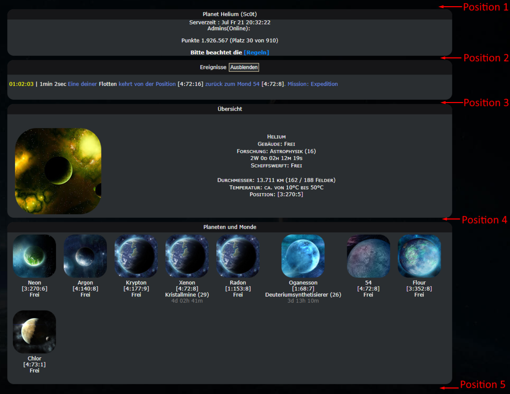

# Sc0ts-Toolbox
Beinhaltet verschiedene erweiterungen für https://pr0game.com/

## Generell
**Aktuell wird nur die Sprache Deutsch unterstützt.**

Fügt in der Navigation einen Tab "Sc0ts Toolbox" hinzu.
In diesem Tab sind alle Einstellungen für alle Module enthalten. Neue Module sind standardmäßig deaktiviert.

## Modules
### Planeten Shorcuts
Fügt die Möglichkeit hinzu Shortcuts für Flottenbewegungen Planetenabhängig zu speichern.

Im Shortcut Editor wird eine zusätzliche checkox angezeigt mit dem der Shortcut Planetenbezogen gespeichert wird. Die Referenz ist hierbei der aktuelle asugewählte Planet.

Ist ein Shortcut Planetenbezogen gespeichert wird dieser nur auf dem ausgewählten Planten angezeigt. Ist die Checkbox deaktiviert ist der Shortcut global gültig.

### Notizen
Fügt ein Notizfeld in der Übersicht hinzu.

#### Einstellungen 
Gültigkeitsbereich, 
- global: Notizfeld Synct sich auf jedem Planeten.
- planet: Jeder Planet speichert sein eigenes Notizfeld

Position:
- Verschiedene Positionen innerhalb der Übersichtsseite. Positionen wie im Bild beschrieben

### *TBD...*